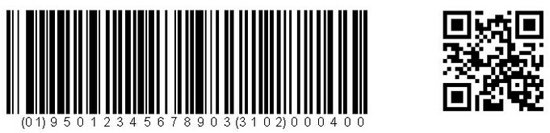

# How Doese QR Cord Conquer China?  :cn:

Yang  Jia 25188201   :girl:   
Zou Peng 25198002 :boy:

## Application :satellite:

### Mobile Payment :yen:

------

### Utilization of Public Resources :bike:
-----

### Origin Tracking :cow2:
-----

### Detailed Information Acquiring :computer:
-----

## Thanks to the squired barcode 

#### Barcode
1. limited capacity of information
2. weak fault-tolerant system

#### QR code
1. large capacity of information(support all types of words)
2. small space
3. strong adaptability to getting dirty and damaged

## Why is mobile payment hot only in China? 

## Some ideas about use of public resources

## Future
