# How Does QR Code Conquer China?  :cn:

Yang  Jia    :girl:   
Zou Peng     :boy:

## Application :satellite:

<https://www.youtube.com/watch?v=gysKE3POUv0>

### Mobile Payment :yen:

Customers can pay with Alipay or WeChat Pay at a stand in Beijing.

It takes only a few seconds to process a transaction.

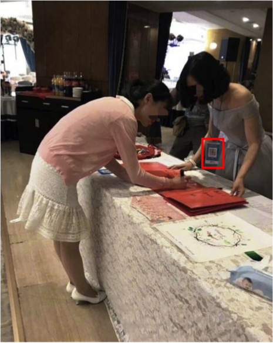

Give and collect gifts at a wedding

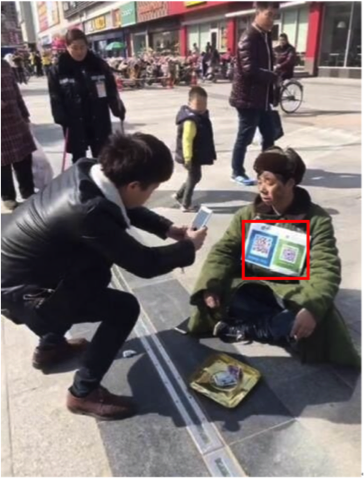

Panhandlers receive donation from mobile payment QR codes 

------

### Utilization of Public Resources :bike:

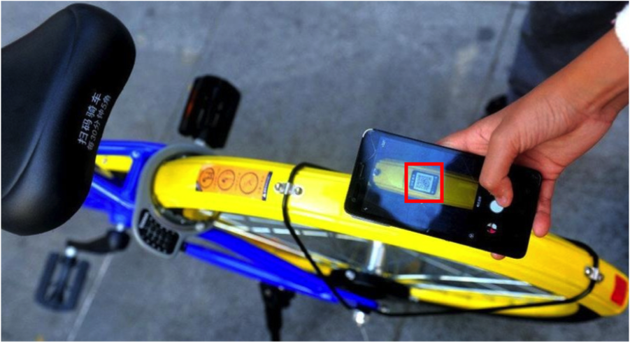

Unlocks a bike of Chinese bike-sharing company Mobike by scanning the QR Code

-----

### Origin Tracking :cow2:

Identify pets

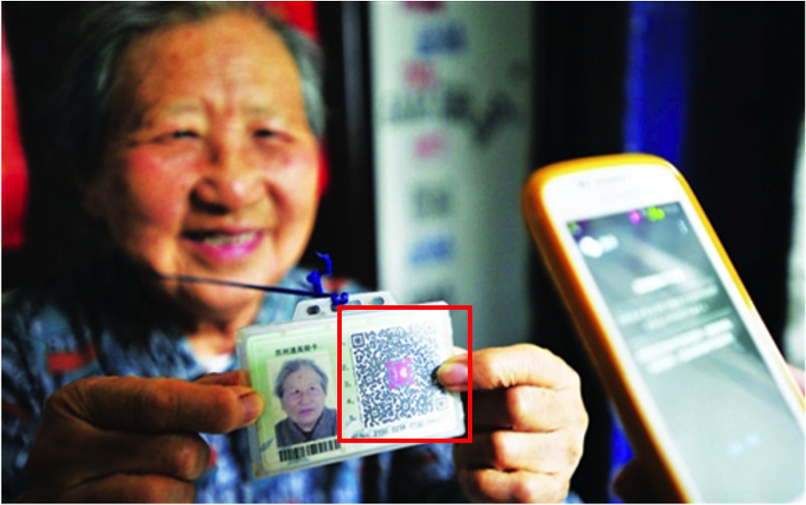

Identify senior citizens & Find losing elders

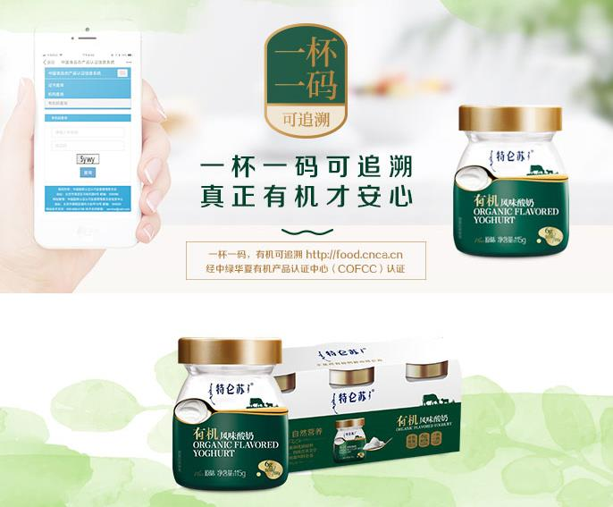

Track food from source to fork

-----

### Detailed Information Acquiring :computer:

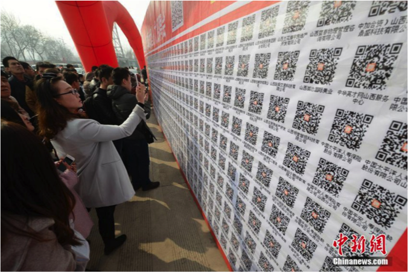

Post and reply to job boards

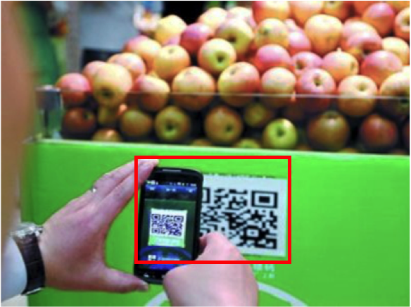

Check authenticity and gain more information about foods and drinks

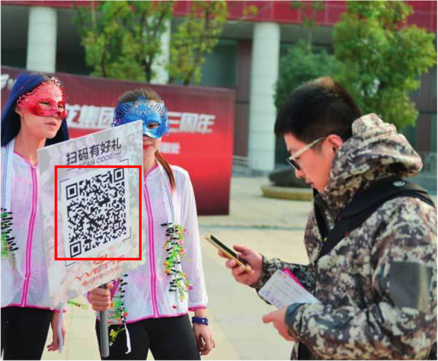

"Scan code to win prizes" promotion

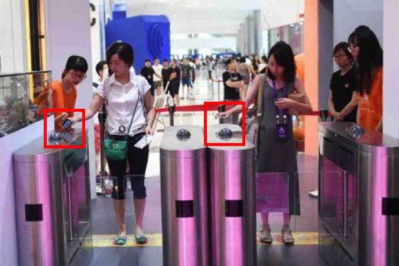

QR code works as identity badge

-----
-----

## Thanks to the sqaured barcode 

#### Barcode
1. limited capacity of information
2. weak fault-tolerant system

#### QR code
1. large capacity of information(support all types of words)
2. small space
3. strong adaptability to getting dirty and damaged

-----
-----

## Mobile Payment _ A Success of Third-party Payment

The banking system of China undertakes two basic business
1. identity authentication 
2. transfer settlement.

characteristics of Mobile Payment Platform in China: 
1. Savings card is the mainstream
2. Instant transfer.

Saving cards:
1. No treshold, open accouts freely
2. Get card instantly
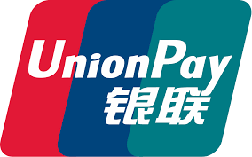

-----
-----

## Sharing Bikes _ A New Utilizaiton Mode of Public Resources 

#### Reason:
1.  dense urban areas & heavy ridership to stay profitable
2.  huge workforce to spread the bikes to the most needed areas

#### Accessibility and convenience requires two things:
1. huge fleet of bikes
2. huge workforce to spread the bikes to the most needed areas

#### China:
1. massive urban population
2. large, cheap labor force
3. support from gov

-----
-----

## Future

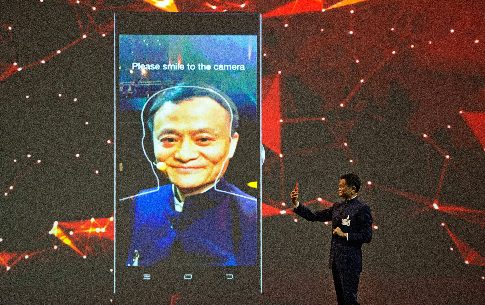

The founder of Alibaba, Jack Ma was showing how to use Facial Recognization to pay by Alipay.
