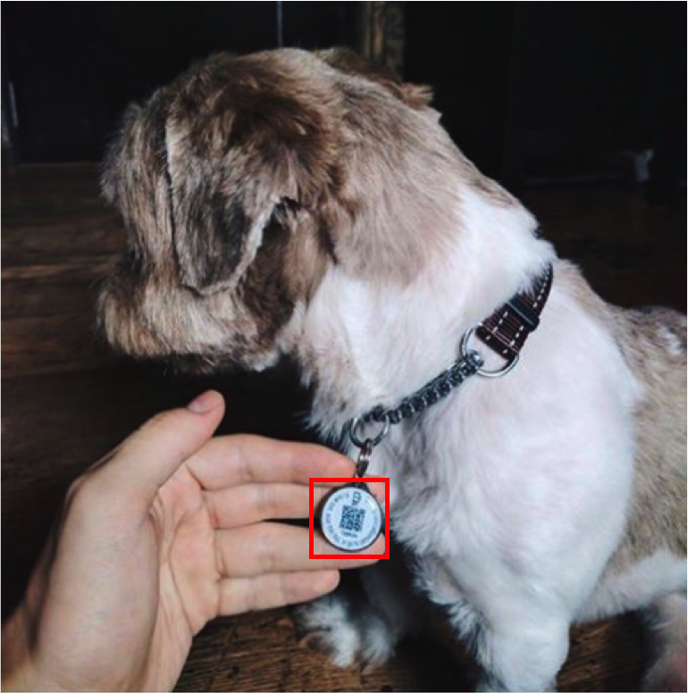

# How Does QR Cord Conquer China?  :cn:

Yang  Jia   25188201   :girl:   
Zou Peng   25198002 :boy:

## Application :satellite:

### Mobile Payment :yen:

Customers can pay with Alipay or WeChat Pay at a stand in Beijing.

It takes only a few seconds to process a transaction.

Give and collect gifts at a wedding

Panhandlers receive donation from mobile payment QR codes 

------

### Utilization of Public Resources :bike:

Unlocks a bike of Chinese bike-sharing company Mobike by scanning the QR Code

-----

### Origin Tracking :cow2:

Identify pets

Identify senior citizens & Find losing elders

Track food from source to fork

-----

### Detailed Information Acquiring :computer:

Post and reply to job boards

Check authenticity and gain more information about food and drinks

"Scan code to win prizes" promotion

QR code as identity badge

-----

## Thanks to the squired barcode 

#### Barcode
1. limited capacity of information
2. weak fault-tolerant system

#### QR code
1. large capacity of information(support all types of words)
2. small space
3. strong adaptability to getting dirty and damaged

## Why is mobile payment hot only in China? 

## Sharing Bikes _ A new utilizaiton mode of public resources 

#### Reason:
1.  dense urban areas & heavy ridership to stay profitable
2.  huge workforce to spread the bikes to the most needed areas

#### Accessibility and convenience requires two things:
1. huge fleet of bikes
2. huge workforce to spread the bikes to the most needed areas

#### China:
1. massive urban population
2. large, cheap labor force
3. support from gov

## Future
