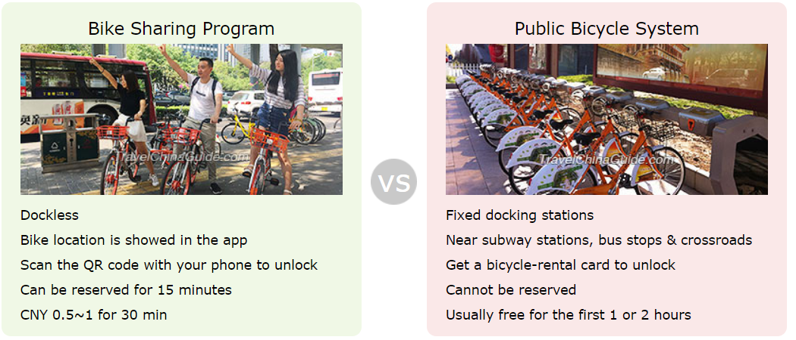
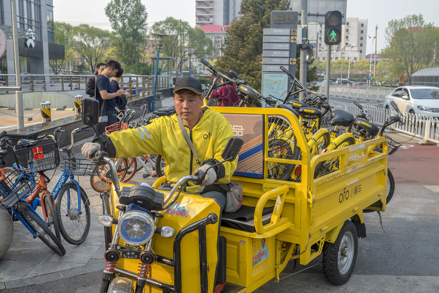

# How Does QR Code Conquer China?  :cn:

Yang Jia     :girl:   
Zou Peng     :boy:

## Application :satellite:

<https://www.youtube.com/watch?v=gysKE3POUv0>

### Mobile Payment :yen:

Customers can pay with Alipay or WeChat Pay at a stand in Beijing.

It takes only a few seconds to process a transaction.

Give and collect gifts at a wedding

Panhandlers receive donation from mobile payment QR codes 

------

### Utilization of Public Resources :bike:

Unlocks a bike of Chinese bike-sharing company Mobike by scanning the QR Code

-----

### Origin Tracking :cow2:

Identify pets

Identify senior citizens & Find losing elders

Track food from source to fork

-----

### Detailed Information Acquiring :computer:

Post and reply to job boards

Check authenticity and gain more information about foods and drinks

"Scan code to win prizes" promotion

QR code works as identity badge

-----
-----

## Thanks to the sqaured barcode 

#### Barcode
1. limited capacity of information
2. weak fault-tolerant system

#### QR code
1. large capacity of information(support all types of words)
2. small space
3. strong adaptability to getting dirty and damaged

-----
-----

## Mobile Payment _ A Success of Third-party Payment

The banking system of China undertakes two basic business
1. identity authentication 
2. transfer settlement.

characteristics of Mobile Payment Platform in China: 
1. Savings card is the mainstream
2. Instant transfer.

Saving cards:
1. No treshold, open accouts freely
2. Get card instantly

-----
-----

## Sharing Bikes _ A New Utilizaiton Mode of Public Resources 
  
[Bike-sharing is booming in China]

### 1.why is sharing bikes so popular in China?

- dockless, it can be parked anywhere. 
|| fixed docking stations, only park in specific location very inconvenient
- bike location is showed in the app, actually, not necessary
|| station, walk to

### 2. why they can't crack other countries

[Bike-sharing companies like Mobike and Ofo getting lost in translation]

#### [1] Accessibility and convenience requires two things:

- a huge fleet of bikes
- a huge workforce to spread the bikes to the most needed areas

#### [2] Profitable for their companies:
- dense urban areas & heavy ridership to stay profitavle

- huge workforce to spread the bikes to the most needed areas

#### [3] Relatively lax regulation

#### [4] Support from the government

#### To conclude:
-----
- massive urban population
- a large, cheap labor force
- relatively lax regulation on bike parking 
- support from gov

-----
-----

## Future

The founder of Alibaba, Jack Ma was showing how to use Facial Recognization to pay by Alipay.
China is on the way...
